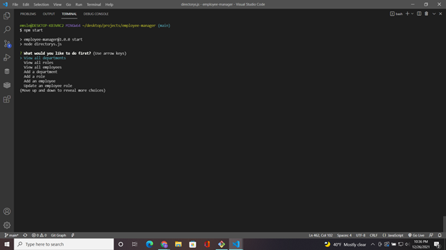
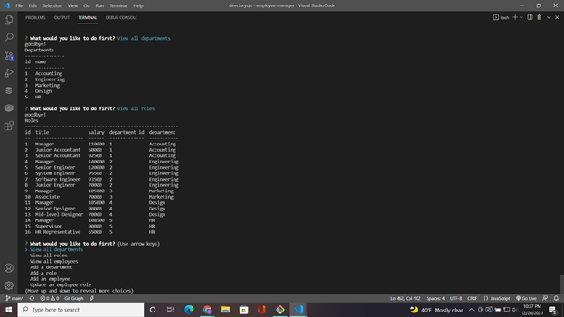
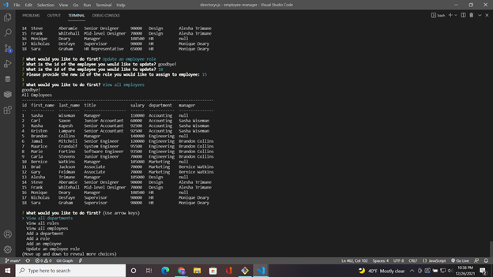

# Employee-manager 
  ## Description 

  This is a project that utilizes node.js, sql, and good old javascript to sort a companies employees into a secure database. From there you can navigate the database in the command line by answering questions through inquirer prompts. The pre-created choices allow any manager to catalog, remove, and view all employees, role, and departments in the company. Making this makes life easier for any boss, while helping me learn all the intricate ways to organize and recall data from the popular SQL database, and this knowledge is guaranteed to stick with me for a long time.

  ## Table of Contents
  In here you will find links to each section of this projects readme
  - [Installation](#installation)
  - [Usage](#usage)
  - [License](#license)
  - [Images/Videos](#images/videos)
  - [Questions](#questions)

  ## *Installation*

  To install this application you should navigate to my github page from the link provided at the bottom of this readme. There you can go to the repository mathcing the project name and download all project files onto your local system. Once all files are downloaded navigate to the directory containg employee-manager files, and git init a node package.json, then you can npm install all dependencies linked with file.

  ## Usage 

  Once all dependancies are installed, you can insure a smooth connection to database by using dot env, and creating a .env file in root of project files. Include your sql password, username, and for the database name copy it from  db.sql file. Log into sql, and locate all sql type files in db folder. Using the command "source db/-project file-" yo ucan create and seed a database. Just remeber to use closing semicolon to close all sql statements. Then you can start app in command line or integrated terminal with command npm start.
 
  ## Images/Videos

  
  
  

  - Video Link: [Video Demo]()

  ## *License*

  Copyright 2021 &copy; Denva Emsley

      Permission is hereby granted, free of charge, to any person obtaining a 
      copy of this software and associated documentation files (the "Software"), 
      to deal in the Software without restriction, including without limitation 
      the rights to use, copy, modify, merge, publish, distribute, sublicense, 
      and/or sell copies of the Software, and to permit persons to whom the Software 
      is furnished to do so, subject to the following conditions:
          
      The above copyright notice and this permission notice shall be included in all copies or substantial portions of the Software.
          
      THE SOFTWARE IS PROVIDED "AS IS", WITHOUT WARRANTY OF ANY KIND, EXPRESS OR IMPLIED, INCLUDING BUT NOT LIMITED TO THE WARRANTIES OF MERCHANTABILITY, FITNESS FOR A PARTICULAR 
      PURPOSE AND NONINFRINGEMENT. IN NO EVENT SHALL THE AUTHORS OR COPYRIGHT HOLDERS BE LIABLE FOR ANY CLAIM, DAMAGES OR OTHER LIABILITY, WHETHER IN AN ACTION OF CONTRACT, TORT OR OTHERWISE, 
      ARISING FROM, OUT OF OR IN CONNECTION WITH THE SOFTWARE OR THE USE OR OTHER DEALINGS IN THE SOFTWARE.
      

  ## Questions 

  - My GitHub username: Demsley1
  - Link to my GitHub page and repositories: [Github Link](https://github.com/Demsley1)
  _Link to my main work email if anyone should ever choose to contact me regarding work, or with helpful suggestions on how to improve this project and 
  also fix or update any major issues with project_
  - For All inquires email me at: emsley3684@gmail.com
